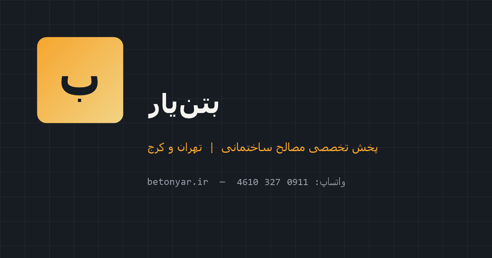

# بتن‌یار — پخش و فروش مصالح ساختمانی

> وب‌سایت نمایشی فروشگاهی (بدون فریم‌ورک، بدون بیلد استپ) — طراحی و توسعه کامل فرانت‌اند

**دموی زنده:** [https://code-watch-dev.github.io/beton-yar/](https://code-watch-dev.github.io/beton-yar/)



---

## معرفی

وب‌سایت چندصفحه‌ای «بتن‌یار» یک فروشگاه مصالح ساختمانی است که با HTML/CSS/جاوااسکریپت خالص ساخته شده؛ بدون هیچ وابستگی، فریم‌ورک یا مرحله بیلد. هدف پروژه اثبات تسلط بر پایه‌های وب است: طراحی ریسپانسیو، دسترس‌پذیری، بهینه‌سازی عملکرد و تبدیل بازدیدکننده به مشتری (واتس‌اپ‌محور).

## ویژگی‌ها

- **۵ صفحه کامل:** خانه، کاتالوگ محصولات، صفحه محصول، درباره‌ما، تماس با ما
- **کاتالوگ دادهمحور:** ۲۰ محصول در ۸ دسته با فیلتر چیپ‌بند و جستجوی زنده (سازگار با ارقام فارسی)
- **تبدیل واتس‌اپ‌محور:** فرم تماس، پیام سفارش واقعی واتس‌اپ می‌سازد؛ دکمه «سفارش» هر کارت، متن اختصاصی همان محصول را ارسال می‌کند
- **ریسپانسیو کامل:** ۸ اندازه‌عرض از موبایل ۳۲۰px تا دسکتاپ ۱۹۲۰px
- **ماشین حساب مصالح** و **پرسش‌های متداول (آکاردئون)** در صفحه اصلی

## دسترس‌پذیری و عملکرد

- **WCAG AA:** کنتراست رنگ‌ها ۴.۵:۱ به بالا، سلسله‌مراتب صحیح عنوان‌ها (h1 در هر صفحه)
- **منوی کشویی موبایل** با معناشناسی دیالوگ (`role="dialog"` + `aria-modal`)، تله فوکوس، `inert` پس‌زمینه و برگرداندن فوکوس
- **فرم‌ها:** `aria-required`، `aria-invalid`، فوکوس به اولین خطا، اعلان زنده محاسبات (`aria-live`)
- **فونت وازمتین self-host شده** (۱۲ فایل woff2 با `unicode-range`) — حذف Google Fonts مسدودکننده رندر، همراه `preload` و `font-display: swap`
- **مش/برداری نقشه** (lazy)، انیمیشن ذرات canvas با توقف هوشمند (`rAF` + `visibilitychange` + `prefers-reduced-motion`)
- سئوی پایه: `canonical`، Open Graph، Twitter Cards و تصویر اشتراک‌گذاری اختصاصی

## تکنولوژی‌ها

| | |
|---|---|
| زبان‌ها | HTML5، CSS3، جاوااسکریپت خالص (ES2020+) |
| سبک | CSS سفارشی با توکن‌های طراحی (`:root`) و سیستم مقیاس تایپوگرافی |
| وابستگی | صفر — بدون فریم‌ورک، بدون بیلد، بدون پکیج |
| خط‌فارسی | وازمتین self-host |

## ساختار پروژه

```
beton-yar/
├── index.html          صفحه اصلی
├── products.html       کاتالوگ ۲۰ محصولی
├── product.html        صفحه محصول تکی
├── about.html          درباره ما
├── contact.html        تماس با ما
├── css/
│   ├── style.css       کل استایل‌ها + توکن‌های طراحی
│   ├── fonts.css       فیس‌های فونت self-host
│   └── fonts/          ۱۲ فایل woff2 (۶ عربی + ۶ لاتین)
├── js/
│   └── main.js         ماژول‌های: منو/دیالوگ، فرم، کاتالوگ، ماشین‌حساب، سال شمسی…
└── favicon.svg         + پیکوگرام‌ها و تصویر OG
```

## اجرای محلی

نیازی به نصب نیست؛ کافیست فایل را در مرورگر باز کنید:

```
open index.html        # یا در ویندوز: start index.html
```

برای تجربه کامل (فونت و فایل‌های محلی) می‌توانید از یک سرور استاتیک ساده استفاده کنید:

```
python -m http.server 8000
```

## تست و کنترل کیفیت

- چک‌لیست کنترل کیفیت روی **۴۰ ترکیب** (۵ صفحه × ۸ اندازه‌عرض) با اجرای مرورگر واقعی: بدون خطای جاوااسکریپت، بدون سرریز افقی، دکمه‌ها/منو/بندهای ناوبری در هر اندازه‌عرض صحیح
- اعتبارسنجی خودکار: resolve شدن کامل آیکون‌های SVG، تست تعاملات کاتالوگ (فیلتر/جستجو/حالت خالی)، تست کشوی موبایل و فوکوس
- تاریخچه گیت تمیز: ۵۰+ کامیت معنادار (فارسی و انگلیسی) — هر تغییر کوچک و قابل بازبینی
